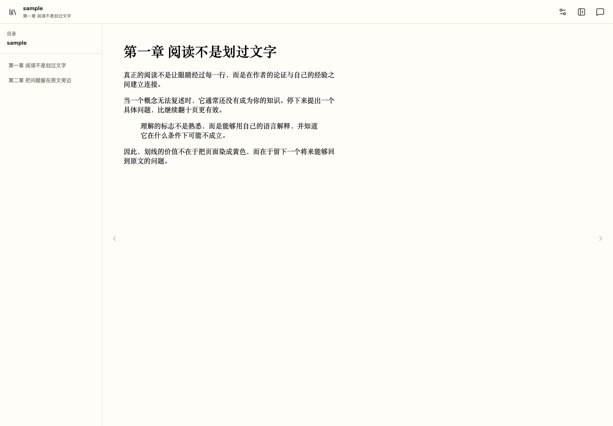
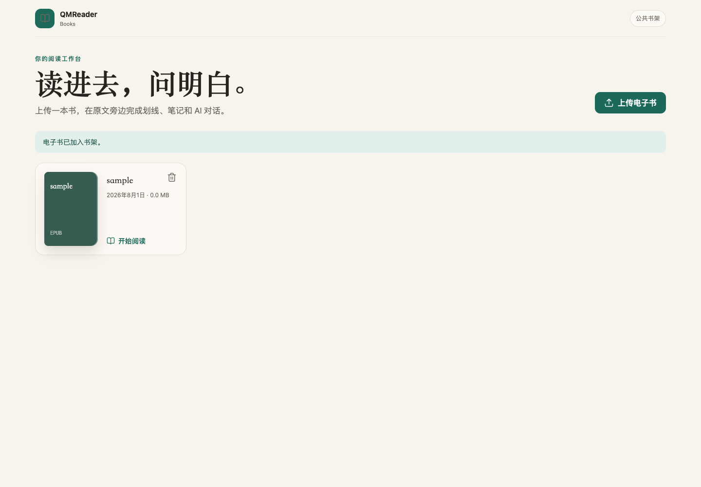
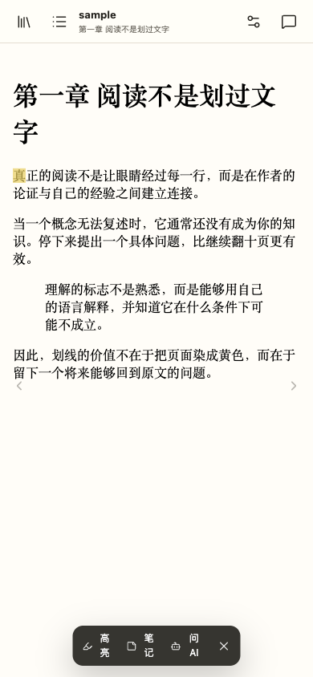

# QMReader Books

**中文** | [English](#english)



> 上传一本电子书，在原文旁边完成阅读、划线、笔记和 AI 对话。
> Read, highlight, annotate, and talk with AI beside the original text.

[在线体验](https://read.qiaomu.ai) · [产品截图](#产品巡游) · [部署说明](#部署)

**已验证：** `pnpm lint`、`pnpm exec tsc --noEmit`、`pnpm build`，以及桌面/移动端真实浏览器闭环。

## 这是什么

QMReader Books 是一个自托管在线电子书阅读器，面向希望真正理解一本书的读者。它把目录、正文和 AI 组织在同一个阅读工作台里：选中原文即可高亮、记笔记或发起问题，也能按当前章节或全书范围检索上下文。

## 核心能力

| 能力 | 用户得到什么 |
| --- | --- |
| EPUB 阅读 | 上传、目录导航、翻页、断点续读 |
| AZW3 / MOBI 导入 | 服务端通过 Calibre 转换为 EPUB；运行环境需提供 `ebook-convert` |
| 阅读排版 | 字体、字号、行高、页宽及亮色、护眼、深色主题 |
| 划线与笔记 | 使用 EPUB CFI 保存定位，刷新后仍能回到原文 |
| 上下文 AI | 支持划线、当前章节、全书检索三种范围和流式回答 |
| 公共书架 | 无需注册或密码，打开网页即可上传、阅读和使用 AI |

## 产品巡游

### 书架



### 桌面阅读工作台


### 移动端正文优先



## 快速开始

```bash
pnpm install
cp .env.example .env
pnpm dev
```

打开 `http://localhost:3000`，无需注册或密码即可进入书架。

## 配置

```dotenv
OPENAI_BASE_URL=https://api.openai.com/v1
OPENAI_API_KEY=server-side-only
OPENAI_MODEL=gpt-4.1-mini
DATA_DIR=./data
```

AI 接口兼容 OpenAI Chat Completions 流式协议。电子书、划线文本和问题仅在用户触发 AI 时按选定范围发送给配置的模型服务。

## 部署

项目提供 Docker Compose，默认只绑定 `127.0.0.1:3487`，由 Nginx 提供公网 HTTPS：

```bash
docker compose up -d --build
curl http://127.0.0.1:3487/api/health
```

生产使用 AZW3/MOBI 时，在宿主机按 [Calibre 官方 Linux 指南](https://calibre-ebook.com/download_linux) 安装独立二进制到 `/opt/calibre`。Compose 会把 `/opt/calibre/calibre` 只读挂载到容器，并通过 `EBOOK_CONVERT_BIN=/opt/calibre/ebook-convert` 调用；镜像只安装必要的无头运行库，避免引入完整 Debian Calibre 图形依赖。

## 架构与隐私

- Next.js 16 / React 19 / TypeScript
- epub.js 渲染与 EPUB CFI 定位
- Lucide 作为唯一通用图标源
- 单机 JSON + 文件目录持久化，适合个人 VPS
- AI 密钥只存在于服务端环境变量
- 不提供 DRM 破解，只接受用户合法拥有的无 DRM 电子书

## 实测验证

```bash
pnpm lint
pnpm exec tsc --noEmit
pnpm build
BASE_URL=http://localhost:3000 node scripts/verify-ui.mjs
```

浏览器脚本会验证公共访问、上传测试 EPUB、打开阅读、文本划线、选区 AI 请求、桌面与移动端无横向溢出，并保存真实截图。

## 限制

- 第一版是公共共享书架；任何访客都可以上传和阅读，删除凭证只保存在原上传浏览器。请勿上传敏感或无权分享的内容。
- 阅读进度、排版和划线当前保存在浏览器本地；更换浏览器不会自动同步。
- 全书模式使用客户端章节索引与关键词检索，不是向量数据库。
- DRM 电子书不会被解密或转换。

## 关于向阳乔木

项目由 [向阳乔木](https://qiaomu.ai) 创建。他是一位把 AI 前沿变化转译成产品判断、可执行工作流和 AI coding 实践的中文 AI 创作者。

[博客](https://blog.qiaomu.ai) · [乔木推荐](https://tuijian.qiaomu.ai/) · [X @vista8](https://x.com/vista8) · [GitHub @joeseesun](https://github.com/joeseesun/)

## License

[MIT](LICENSE)

---

<a name="english"></a>

# English

QMReader Books is a self-hosted ebook reading workspace for people who want to understand a book rather than merely scroll through it. Upload a DRM-free EPUB, read with persistent typography and location settings, highlight passages, take notes, and ask AI about a selection, the current chapter, or retrieved chapters from the whole book.

## Quick start

```bash
pnpm install
cp .env.example .env
pnpm dev
```

The production app is publicly accessible without registration, with an OpenAI-compatible streaming endpoint, local file/JSON storage, epub.js, Lucide icons, and a Docker/Nginx deployment. Run `pnpm lint`, `pnpm exec tsc --noEmit`, `pnpm build`, and `node scripts/verify-ui.mjs` to verify it.

Main limits: a shared public bookshelf, browser-local reading annotations, keyword-based whole-book retrieval, and DRM-free books only. Any visitor can upload; only the original browser receives the local deletion token. AZW3/MOBI conversion uses an official Calibre binary mounted read-only from the host.

Live app: [read.qiaomu.ai](https://read.qiaomu.ai) · License: [MIT](LICENSE) · Security: [SECURITY.md](SECURITY.md)
